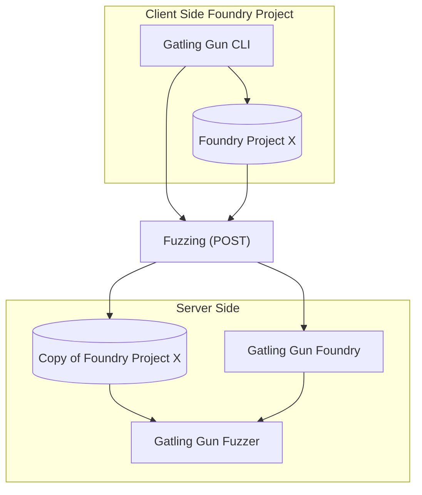

# Architecture

```mermaid
graph TD;

subgraph AA [Client Side Foundry Project]
A[Gatling Gun CLI];
D[(Foundry Project X)];
end

subgraph BB [Server Side]
E[Gatling Gun Fuzzer];
F[Gatling Gun Foundry];
G[(Copy of Foundry Project X)];
end

Z["Fuzzing (POST)"];


A --> Z;
A --> D;
D --> Z;

Z --> G & F --> E;


```

