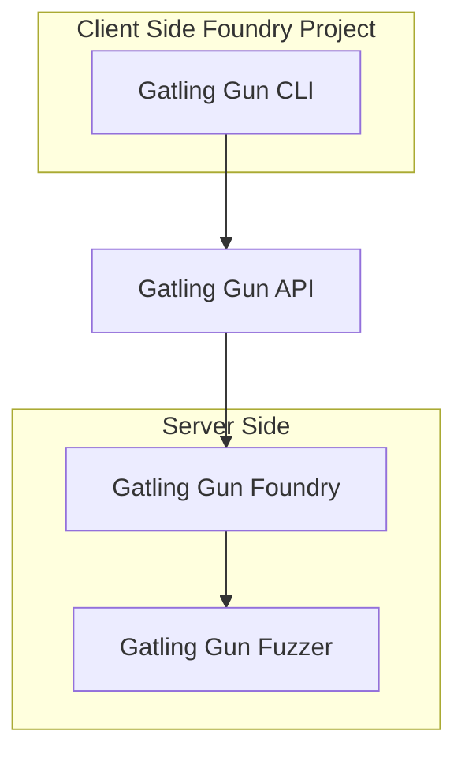

import { Callout } from 'nextra/components'

# Welcome to the `ggun` (Gatling Gun) Documentation!

<Callout type="warning" emoji="⚠️">
  Gatling Gun is still in closed alpha. There may be some stability issues and changes to the API.
</Callout>


This documentation provides a comprehensive guide for using the Gatling Gun API to integrate our solutions seamlessly.

## What's Gatling Gun?

Gatling Gun is an upgraded fork of [Foundry](https://book.getfoundry.sh/forge/) a command-line tool that tests, builds, and deploys your smart contracts. 

It uses a different backend fuzzer to Foundry, and is designed to work with the Gatling Gun API.

You can use Gatling Gun CLI in your foundry based projects, and it will work with the Gatling Gun API. In particular, running `ggun test` should yield exactly the same results.

```sh test copy
$ ggun test
No files changed, compilation skipped

Ran 2 tests for test/Counter.t.sol:CounterTest
[PASS] testFuzz_SetNumber(uint256) (runs: 256, μ: 30474, ~: 31252)
[PASS] test_Increment() (gas: 31225)
Suite result: ok. 2 passed; 0 failed; 0 skipped; finished in 15.15ms (14.74ms CPU time)

Ran 1 test suite in 15.65ms (15.15ms CPU time): 2 tests passed, 0 failed, 0 skipped (2 total tests)

```


### How does it work?




## 🔑 Get API Key

<Callout type="info" emoji="ℹ️">
  You need an API key to use Gatling Gun.
</Callout>

To get started, you need to sign up on [Gatling Gun](https://ggun.com) and get an API key.

