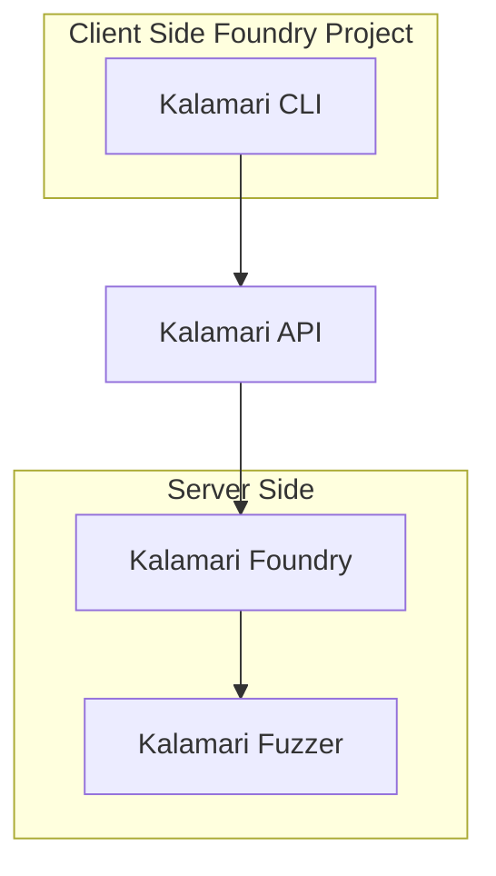

import { Callout } from 'nextra/components'

# Welcome to Kalamari Documentation!

<Callout type="warning" emoji="⚠️">
  Kalmari is still in closed alpha. There may be some stability issues and changes to the API.
</Callout>


This documentation provides a comprehensive guide for using the Kalmari API to integrate our solutions seamlessly.

## What's Kalamari?

Kalamari is an upgraded fork of [Foundry](https://book.getfoundry.sh/forge/) a command-line tool that tests, builds, and deploys your smart contracts. 

It uses a different backend fuzzer to Foundry, and is designed to work with the Kalamari API.

You can use Kalamari CLI in your foundry based projects, and it will work with the Kalamari API. In particular, running `kalamari test` should yield exactly the same results.

```sh test copy
$ kalamari test
No files changed, compilation skipped

Ran 2 tests for test/Counter.t.sol:CounterTest
[PASS] testFuzz_SetNumber(uint256) (runs: 256, μ: 30474, ~: 31252)
[PASS] test_Increment() (gas: 31225)
Suite result: ok. 2 passed; 0 failed; 0 skipped; finished in 15.15ms (14.74ms CPU time)

Ran 1 test suite in 15.65ms (15.15ms CPU time): 2 tests passed, 0 failed, 0 skipped (2 total tests)

```


### How does it work?




## 🔑 Get API Key

<Callout type="info" emoji="ℹ️">
  You need an API key to use Kalamari.
</Callout>

To get started, you need to sign up on [Kalmari](https://kalmari.com) and get an API key.

