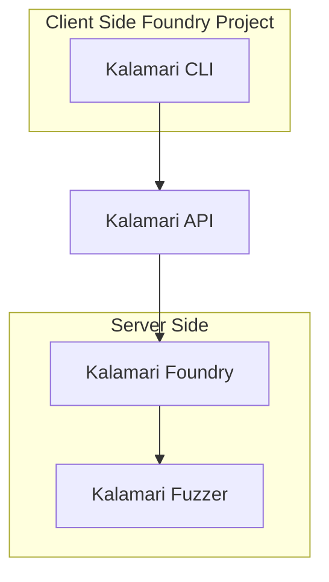

import { Callout } from 'nextra/components'

# Welcome to Kalamari Documentation!

<Callout type="warning" emoji="⚠️">
  Kalmari is still in closed alpha. There may be some stability issues and changes to the API.
</Callout>

This documentation provides a comprehensive guide for using the Kalmari API to integrate our solutions seamlessly.

## What's Kalamari?

## 🔑 Get API Key

<Callout type="info" emoji="ℹ️">
  You need an API key to use Kalamari.
</Callout>

To get started, you need to sign up on [Kalmari](https://kalmari.com) and get an API key.

