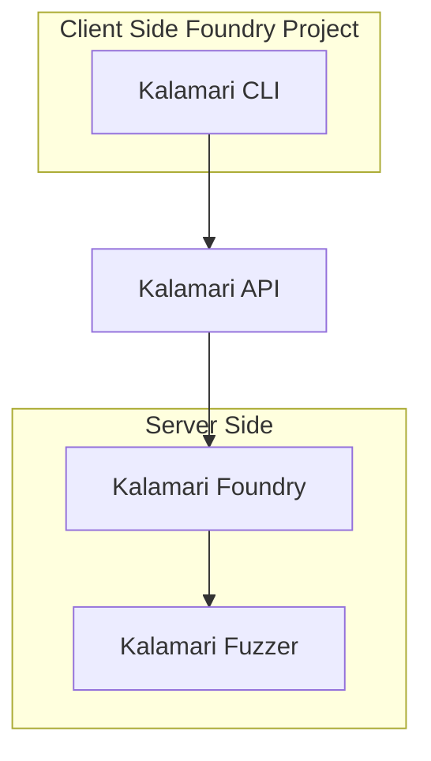

# Welcome to Kalamari API Documentation!

This documentation provides a comprehensive guide for using the Kalmari API to integrate our solutions seamlessly.

## What's Kalamari?

## 🔑 Get API Key

To get started, you need to sign up on [Kalmari](https://kalmari.com) and get an API key.

